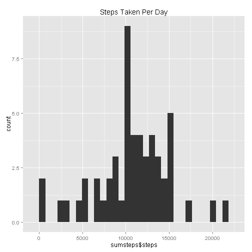
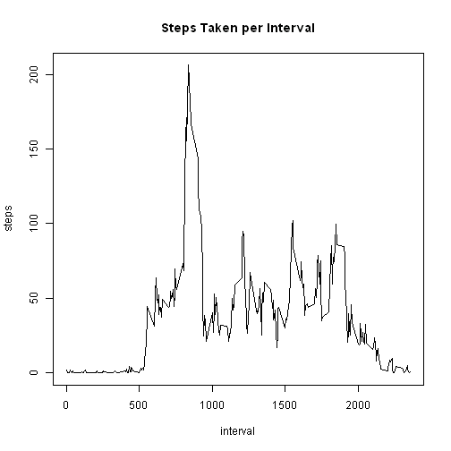
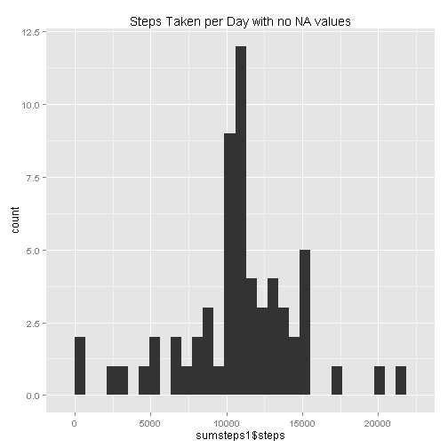
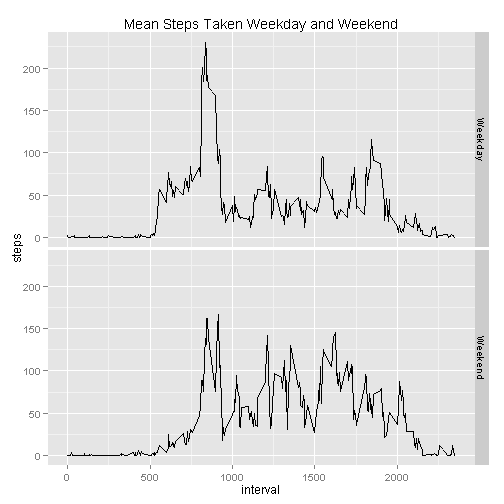

Peer Assessment #1
========================================================

**Below is a reproducible analysis for Peer Assessment assignment #1**

**Loading and Processing the Data**

Load data

```r
data <- read.table(unz("repdata-data-activity.zip", "activity.csv"), header = TRUE, sep = ",")

data$date <- as.Date(data$date)
data1 <- data
```

**What is mean total number of steps taken per day**

Create historgram of steps taken per day

```r
sumsteps <- aggregate(steps ~ date, data, sum)
library(ggplot2)
ggplot(sumsteps, aes(x = sumsteps$steps)) + geom_histogram() + labs(title = "Steps Taken Per Day")
```

 

The steps below calculate the mean and median of the total number of steps taken per day

```r
meansteps <- mean(sumsteps$steps)
mediansteps <- median(sumsteps$steps)
```

**What is the average daily activity pattern**

Create a time-series plot of the interval and the average number of steps each interval

```r
intervalmeans <- aggregate(steps ~ interval, data, mean)
intervalmeans1 <- intervalmeans
plot(steps ~ interval, data = intervalmeans, main = "Steps Taken per Interval", type = "n")
lines(intervalmeans$interval, intervalmeans$steps)
```

 

Code below returns the max average number of step from the intervals accross all days

```r
u <- which.max(intervalmeans$steps)
intervalmeans[u, ]
```

```
##     interval steps
## 104      835 206.2
```

**Inputing missing values**

Below are total number of NA values using the summary function of the steps in data frame data

```r
summary(data$steps)
```

```
##    Min. 1st Qu.  Median    Mean 3rd Qu.    Max.    NA's 
##     0.0     0.0     0.0    37.4    12.0   806.0    2304
```

The process below will create a new dataset and replace the NA values with the mean of each missing values respective interval


```r
library(dplyr)
tempdf <- select(intervalmeans1, c(interval, Average = steps))
data1 <- inner_join(data1, tempdf, by = "interval")
data1 <- arrange(data1, date)
for(row_number in 1:nrow(data1)) {
        if(is.na(data1$steps[row_number]))
                data1$steps[row_number] <- data1$Average[row_number]
}
data1 <- data1[, 1:3]
head(data1)
```

```
##     steps       date interval
## 1 1.71698 2012-10-01        0
## 2 0.33962 2012-10-01        5
## 3 0.13208 2012-10-01       10
## 4 0.15094 2012-10-01       15
## 5 0.07547 2012-10-01       20
## 6 2.09434 2012-10-01       25
```

Graph below shows there is no difference in the dataframes with and without the NA values included

```r
sumsteps1 <- aggregate(steps ~ date, data1, sum)
ggplot(sumsteps1, aes(x = sumsteps1$steps)) + geom_histogram() + labs(title = "Steps Taken per Day with no NA values")
```

 

calculate and report the mean and median values of the two datasets (i.e. with and without NAs). There is no difference in mean values of either the dataset with NAs and the dataset without NAs, and a value of 1 difference in the median values between the datasets. There is zero to very minimal difference in the final output between the datasets


```r
meansteps1 <- mean(sumsteps1$steps)
mediansteps1 <- median(sumsteps1$steps)

meansteps ## with NAs
```

```
## [1] 10766
```

```r
meansteps1 ## No NAs
```

```
## [1] 10766
```

```r
mediansteps ## with NAs
```

```
## [1] 10765
```

```r
mediansteps1 ## No NAs
```

```
## [1] 10766
```

**Are there differences in activity patterns between weekdays and weekends**

Code below generates a new factor variable added to the data frame indicating a weekend or weeday for the respective date

```r
library(lubridate)
data1$day <- wday(data1$date, label = TRUE)
data1$day <- as.character(data1$day)
data1$day[data1$day == "Mon"] <- "Weekday"
data1$day[data1$day == "Tues"] <- "Weekday"
data1$day[data1$day == "Wed"] <- "Weekday"
data1$day[data1$day == "Thurs"] <- "Weekday"
data1$day[data1$day == "Fri"] <- "Weekday"
data1$day[data1$day == "Sat"] <- "Weekend"
data1$day[data1$day == "Sun"] <- "Weekend"
data1$day <- as.factor(data1$day)

head(data1)
```

```
##     steps       date interval     day
## 1 1.71698 2012-10-01        0 Weekday
## 2 0.33962 2012-10-01        5 Weekday
## 3 0.13208 2012-10-01       10 Weekday
## 4 0.15094 2012-10-01       15 Weekday
## 5 0.07547 2012-10-01       20 Weekday
## 6 2.09434 2012-10-01       25 Weekday
```

```r
str(data1)
```

```
## 'data.frame':	17568 obs. of  4 variables:
##  $ steps   : num  1.717 0.3396 0.1321 0.1509 0.0755 ...
##  $ date    : Date, format: "2012-10-01" "2012-10-01" ...
##  $ interval: int  0 5 10 15 20 25 30 35 40 45 ...
##  $ day     : Factor w/ 2 levels "Weekday","Weekend": 1 1 1 1 1 1 1 1 1 1 ...
```

Steps below creates a panel plot using qplot of the average number of steps taken per day accross weekdays and weekends

```r
weekday <- subset(data1, data1$day == "Weekday")
weekend <- subset(data1, data1$day == "Weekend")
weekdaymeans <- aggregate(steps ~ interval + day, data = weekday, FUN = mean)
weekendmeans <- aggregate(steps ~ interval + day, data = weekend, FUN = mean)
combined <- rbind(weekdaymeans, weekendmeans)
qplot(interval, steps, data = combined, main = "Mean Steps Taken Weekday and Weekend" ,geom = "line", facets = day ~.)
```

 
